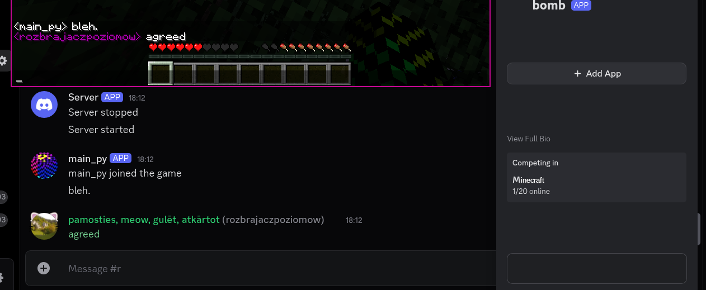

# DiscordSquared

DiscordSquared is a server-only mod for Discord <-> Minecraft communication.
It uses a webhook for Minecraft -> Discord communication and a discord bot for Discord -> Minecraft communication (uses Kord under the hood).

It's also highly configurable and has formattable rich presence, player join/leave/chat/death and server start/stop messages.

## Dependencies

  
DiscordSquared is written in Kotlin, and as such requires Forgelin Continuous to be present.
