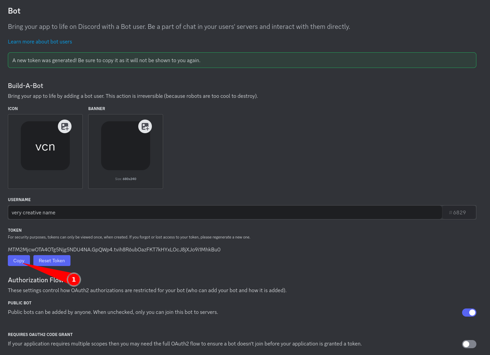
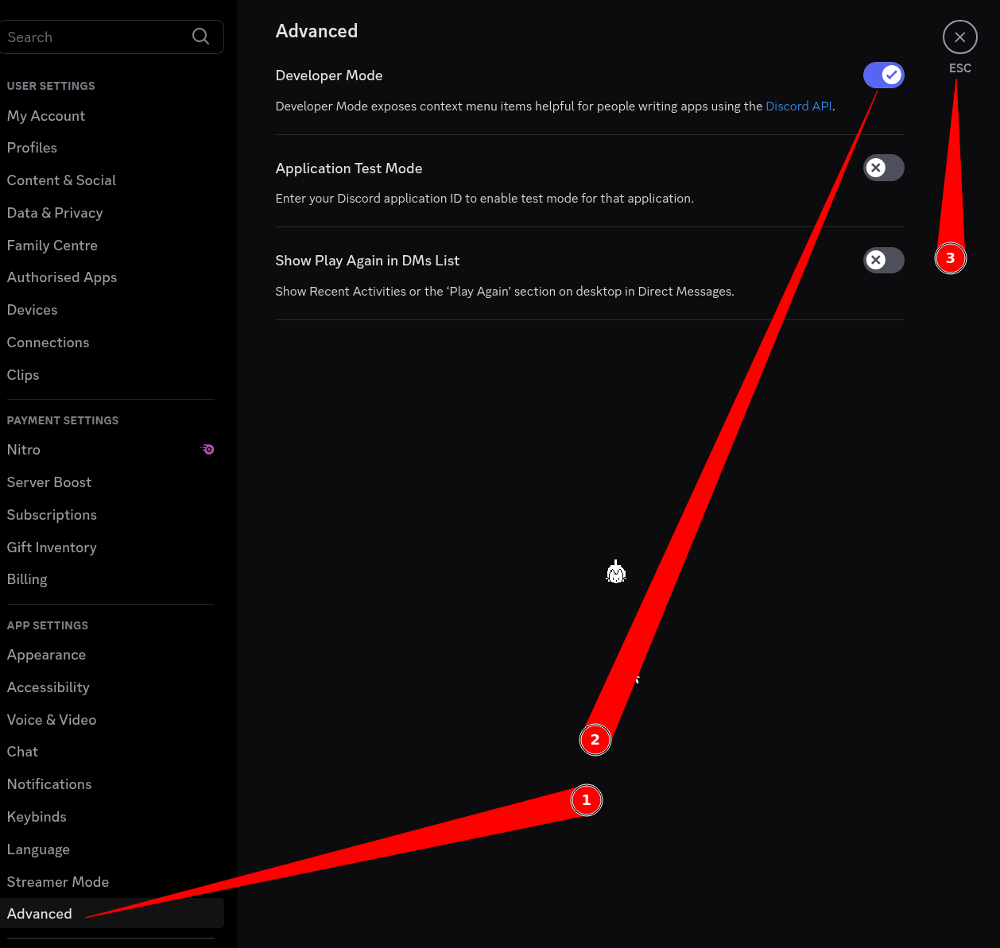
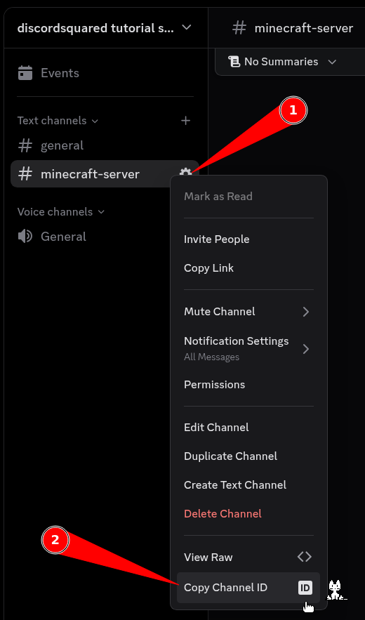

1. Go to <https://discord.com/developers/applications>  
2. Click on New Application  
  
3. Give your app a name, agree to Discord's ToS and click on Create (and complete a CAPTCHA if Discord feels like being annoying that day)  
  
4. Go to Bot  
  
5. Enable the Message Content Intent, click on "Save Changes" and click on "Reset Token" (here you can also change your bot's avatar and username, but that's not required for this tutorial)  
  
6. Press "Yes, do it!" (and type in your password if Discord feels like it)  
  
7. Click on "Copy" (note on tokens: you should never send/show your token to _**anyone**_, doing so will allow them to do **anything** with your bot)  
  
8. Go to Discord Squared's config and (1). change the false to true, (2). paste in your token here (note, the config may have changed between me writing this tutorial and you reading it, but the general format should've stayed the same)  
  
9. Go back to Discord's website and click on OAuth2  
  
10. Scroll to the bottom, press on "bot" in the "Scopes" section, scroll down again and press on "Manage Webhooks" in the "Bot Permissions" section  
  
11. Scroll to the bottom again and press "Copy" on the "Generated URL" field  
  
12. Open the link as a new tab in your browser (or send it in Discord and click on it), select your server of choice (assuming you have created a server, if not, this is the time to do it) and click "Continue"  
  
13. Click on "Authorise"  
  
14. Go back to Discord and go to your Discord server, next, go to your Account Settings, go to "Advanced" and turn on "Developer Mode"  
  
  
15. Go back to your Discord server, right-click on the channel where you want your communication to happen and click on "Copy Channel ID"  
  
16. Go to Discord Squared's config and (1). paste in the channel id here  
  
17. You should be good to go! Be sure to check out the rest of Discord Squared's config  
18. Optional steps:  
- Go back to Discord's Developer Portal and in the "Bot" tab disable "Public Bot" (and click on "Save Changes"), this prevents anyone else from adding your bot to a different server  
- Change your bot's avatar and name to be something instead of Discord's autogenerated bs  
- Go to your chosen channel's settings -> Integrations -> Webhooks -> dscsquared_webhook and change the default avatar  
